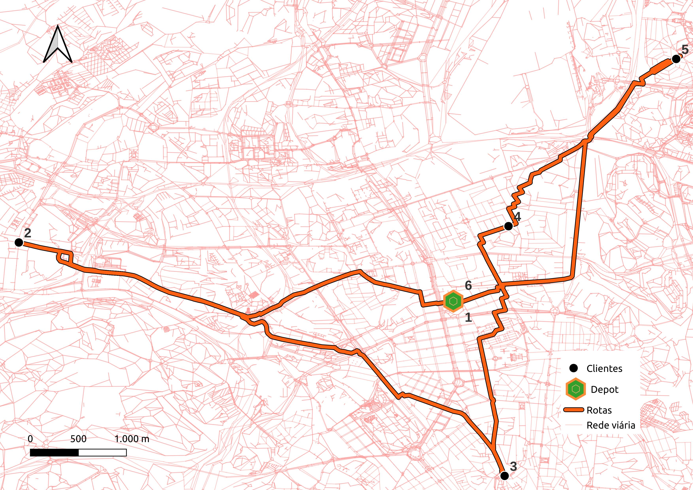

# VRP Network Solver - Case Study

Este repositório contém uma solução personalizada para o **Problema de Roteirização de Veículos (VRP)** aplicada a uma rede viária real. O projeto utiliza uma biblioteca própria desenvolvida em Python, que integra o poder de otimização do **Google OR-Tools** com a manipulação de dados espaciais.

O exemplo contido no notebook utiliza a rede de transporte de **Lisboa** para demonstrar a criação de rotas otimizadas entre diferentes pontos (nós) da cidade.

## 🧠 Lógica do Algoritmo (solve_vrp)

Para resolver o problema de roteirização sobre uma rede viária, o método solve_vrp da classe NetworkVRP segue este fluxo lógico:
Plaintext

ALGORITMO solve_vrp(lista_clientes, deposito, num_veiculos)
    
    1. INICIALIZAÇÃO:
       - Mapeia IDs dos nós da rede para índices internos (0 a N).
       - Define o 'deposito' como ponto de partida e chegada.

    2. CÁLCULO DE MATRIZES (Sobre o Grafo):
       - PARA CADA par de pontos (origem, destino) em [deposito + clientes]:
           - Calcula o caminho mais curto no grafo (Dijkstra/A*).
           - Armazena Distância Total e Tempo Estimado.
       - Gera Matriz de Adjacência completa para o solver.

    3. CONFIGURAÇÃO OR-TOOLS:
       - Cria o Gerenciador de Índices de Roteamento (RoutingIndexManager).
       - Instancia o Modelo de Roteamento (RoutingModel).
       - Registra Callback de Trânsito (Custo = Distância ou Tempo).

    4. DEFINIÇÃO DE RESTRIÇÕES:
       - Define o custo de cada arco.
       - Adiciona dimensões de capacidade ou tempo (se aplicável).
       - Define a estratégia de busca inicial (ex: PATH_CHEAPEST_ARC).

    5. EXECUÇÃO DO SOLVER:
       - Busca a solução que minimiza a função de custo total.

    6. PROCESSAMENTO DA SOLUÇÃO:
       - SE solução encontrada:
           - Recupera a sequência de nós para cada veículo.
           - Reconverte índices internos para IDs originais da rede.
           - Extrai a geometria (links/caminhos) para exportação GeoJSON/Pandas.
       - SENÃO:
           - Retorna Erro: Solução não encontrada.

    7. RETORNO:
       - Entrega GeoDataFrame com rotas, distâncias acumuladas e tempos.
FIM ALGORITMO


## 🚀 Funcionalidades

* **Modelagem de Rede:** Conversão de arquivos de nós (`nodes`) e conexões (`links`) em um grafo direcionado usando `NetworkX`.
* **Cálculo de Matriz de Distância:** Implementação da fórmula de Haversine para precisão em coordenadas geográficas.
* **Otimização com OR-Tools:** Resolução de problemas de logística buscando a minimização de distância e tempo.
* **Integração Geoespacial:** Exportação dos resultados em `GeoDataFrame` (GeoPandas) para fácil visualização e análise de mapas.
* **Visualização:** Suporte para plotagem das rotas geradas sobre a malha urbana.

## 📂 Estrutura do Projeto

* `vrpnetwork.py`: A biblioteca principal. Contém a classe `NetworkVRP` que gerencia a rede, calcula as matrizes e invoca o solver do OR-Tools.
* `VRP_LIS.ipynb`: Notebook demonstrativo que carrega os dados de Lisboa, configura os parâmetros de roteirização e exibe os resultados.
* `nodes_lis2.csv` / `links_lis2.csv`: Base de dados da rede viária de Lisboa (necessários para rodar o exemplo).
* `roteirizacao.jpg`: Exemplo visual do output das rotas otimizadas.

## 🛠️ Pré-requisitos

Para rodar este projeto, você precisará das seguintes bibliotecas:

```bash
pip install ortools networkx pandas geopandas matplotlib shapely
```

## 📖 Como Usar

1.  **Instancie a rede:**
    ```python
    from vrpnetwork import NetworkVRP
    network = NetworkVRP()
    network.load_data("nodes_lis2.csv", "links_lis2.csv")
    ```

2.  **Defina os pontos de demanda:**
    Selecione os IDs dos nós que representam o depósito e os clientes na rede.

3.  **Resolva o problema:**
    O método interno utiliza o OR-Tools para encontrar a sequência lógica que minimiza o custo total da operação.

4.  **Visualize os resultados:**
    O notebook demonstra como converter a solução em geometrias `LineString` e `Point` para visualização em mapas.

## 📊 Exemplo de Resultado

Abaixo, uma representação das rotas calculadas sobre a malha de Lisboa:



## 👤 Autor

**Fábio Emanuel de Souza Morais**
*Mestre em Engenharia de Transportes (USP) | Engenheiro Aeronáutico (ITA)*

